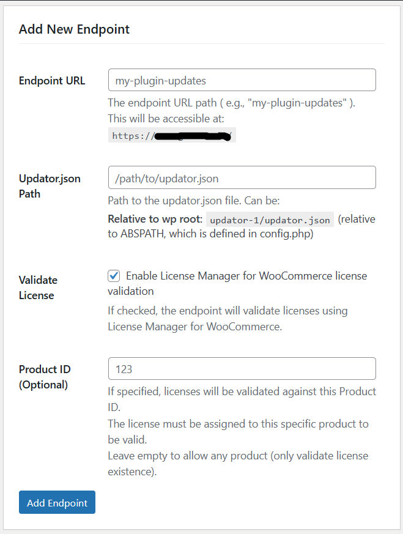
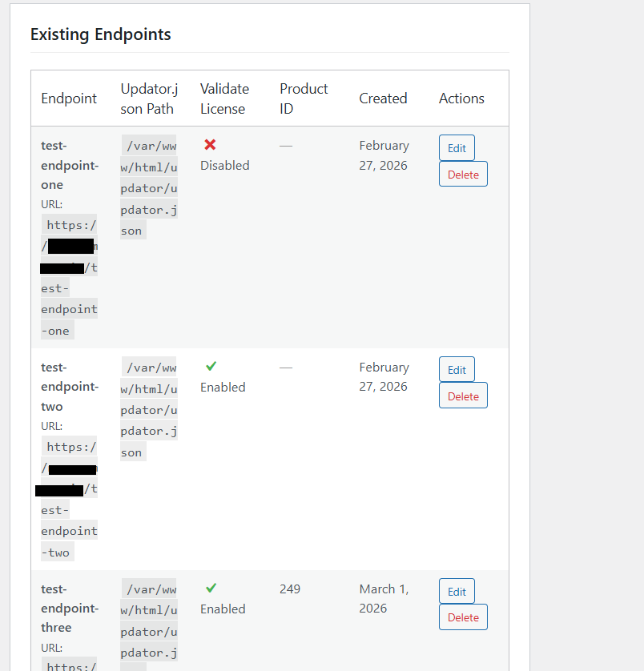

# PUC LMFWC Server

A WordPress plugin that integrates Plugin Update Checker (PUC) with License Manager for WooCommerce (LMFWC) to provide secure plugin updates with license validation.

## 📝 Requirements

- WordPress 5.0+
- PHP 7.2+
- Plugin Update Checker library (on client side) | Tested version 5.6
- WooCommerce (optional, for selling digital items i.e. WordPress plugins) | Tested version 10.5.3 
- License Manager for WooCommerce (for license validation, optional) | Tested version 3.0.15

## 🚀 Quick Start

### 1. Install the Plugin
1. Upload the `puc-lmfwc-server` folder to your WordPress `/wp-content/plugins/` directory
2. Activate the plugin through the 'Plugins' menu in WordPress

### 2. Configure an Endpoint
1. Go to **PUC LMFWC Server** in your WordPress admin menu
2. Add a new endpoint with the following details:
   - **Endpoint URL**: Choose a unique path (e.g., `my-plugin-updates`)
   - **Updator.json Path**: Path to your `updator.json` file (relative to WordPress root)
   - **Validate License**: Enable to require license validation
   - **Product ID**: (Optional) Specific product ID for license validation




### 3. Prepare Your Updator.json File
Create an `updator.json` file that points to your plugin download. This file should be placed as normal.

Example `updator.json`:
```json
{
    "version": "1.2.0",
    "download_url": "https://your-site.com/wp-content/uploads/secure/my-plugin.zip",
    "requires": "5.0",
    "tested": "6.5",
    "last_updated": "2024-01-01",
    "sections": {
        "description": "My awesome plugin description"
    }
    ...
}
```

## 🔧 How It Works

### Two-Step Update Process

#### Step 1: Update Check (First Endpoint Call)
When PUC checks for updates, it calls your endpoint with the license key:

```php
// In your plugin's update checker
require 'plugin-update-checker-5.6/plugin-update-checker.php';
use YahnisElsts\PluginUpdateChecker\v5\PucFactory;

$myUpdateChecker = PucFactory::buildUpdateChecker(
    'https://your-site.com/my-plugin-updates', // Your endpoint
    __FILE__,
    'my-plugin-slug'
);

$myUpdateChecker->addQueryArgFilter(function($queryArgs) {
    $queryArgs['license'] = 'A1A2-CC3A-312B-BA44'; // License key (that your plugin should provide dynamically from user input)
    return $queryArgs;
});
```

The server:
1. Validates the license (if enabled)
2. Loads your `updator.json` file
3. Modifies the `download_url` to point back to the same endpoint with `download=1` parameter
4. Returns the JSON response to PUC

#### Step 2: Download Delivery (Second Endpoint Call)
PUC automatically requests the modified download URL. The server:
1. Validates the license again (if enabled)
2. Reads the actual download URL from `updator.json`
3. Serves the plugin ZIP file from `download_url` path

## 📋 Admin Interface

### Logging
Enable informational logging to debug endpoint requests. Logs appear in the PHP error log with prefix: `ℹ️ INFO 🖥️ 📦`

## 🔐 License Validation through License Manager for WooCommerce

When license validation is enabled:

1. **License Check**: Verifies the license exists in License Manager for WooCommerce
2. **Product ID Matching**: (Optional) Ensures the license is assigned to the specific product
3. **Expiration Check**: Validates that the license hasn't expired

### Required Setup
- License Manager for WooCommerce plugin must be installed and active
- Licenses must be generated through License Manager for WooCommerce
- The plugin uses `lmfwc_get_license()` function for validation

## 💻 Client-Side Implementation

Here's the complete client-side code for your plugin:

```php
// Include PUC library
require_once 'plugin-update-checker-5.6/plugin-update-checker.php';
use YahnisElsts\PluginUpdateChecker\v5\PucFactory;

// Initialize update checker
$myUpdateChecker = PucFactory::buildUpdateChecker(
    'https://your-site.com/your-endpoint-path', // Your configured endpoint
    __FILE__, // Full path to main plugin file
    'your-plugin-slug', // Plugin slug
    12 // Check period in hours
);

// Add license key to requests
$myUpdateChecker->addQueryArgFilter(function($queryArgs) {
    // Get license key from your plugin's settings
    $license_key = get_option('your_plugin_license_key', '');
    if (!empty($license_key)) {
        $queryArgs['license'] = $license_key;
    }
    return $queryArgs;
});
```

## 🛡️ Security Features

1. **Protected Downloads**: Keep your `updator.json` and plugin ZIP files in protected directories
2. **License Validation**: Two-step validation (both update check and download)
3. **Secure Endpoints**: Unique endpoint URLs for each plugin
4. **Input Sanitization**: All inputs are properly sanitized

## 🔍 Debugging

### Enable Logging
1. Go to **PUC LMFWC Server → Logging Settings**
2. Enable informational logging
3. Check your PHP error log for messages prefixed with `ℹ️ INFO 🖥️ 📦`

### Common Issues

**"Updator.json file not found"**
- Ensure the path is correct (relative to WordPress root)
- Check file permissions

**"Invalid license"**
- Verify License Manager for WooCommerce is active
- Check that the license key exists and is active
- Ensure product IDs match (if specified)

**"Endpoint already exists"**
- Choose a unique endpoint URL for each plugin

## 📄 File Structure

```
puc-lmfwc-server/
├── puc-lmfwc-server.php          # Main plugin file
├── README.md                     # This file
└── LICENSE                      # License information
```


## 🤝 Contributing

Feel free to submit issues and pull requests for improvements.

## 📄 License

This plugin is licensed under the GPL v2 or later.

---

**Note**: This plugin works alongside the [Plugin Update Checker](https://github.com/YahnisElsts/plugin-update-checker) library. You need to include PUC in your plugin for the client-side update checking.